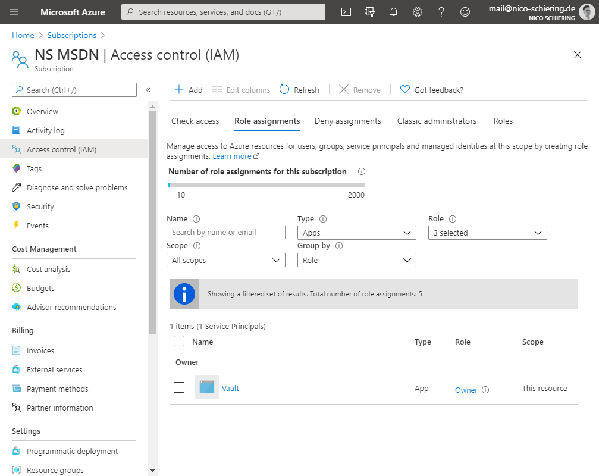
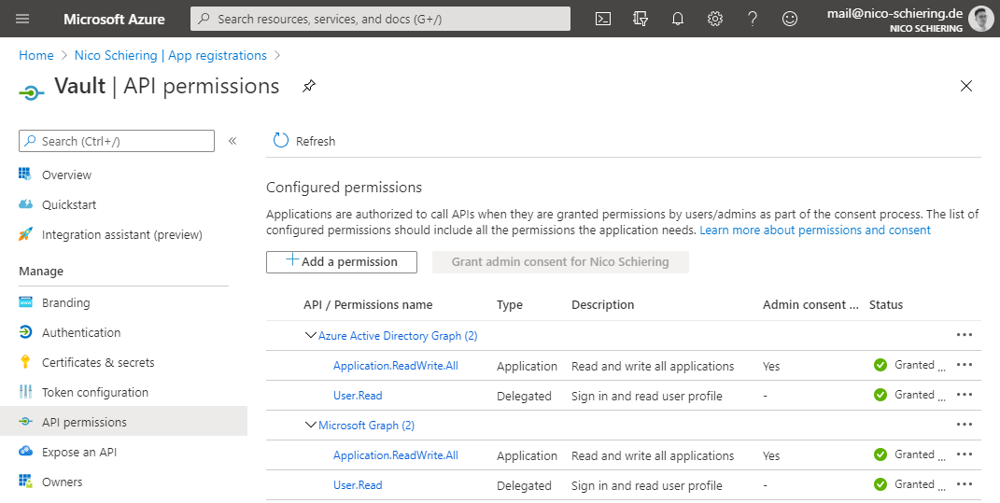
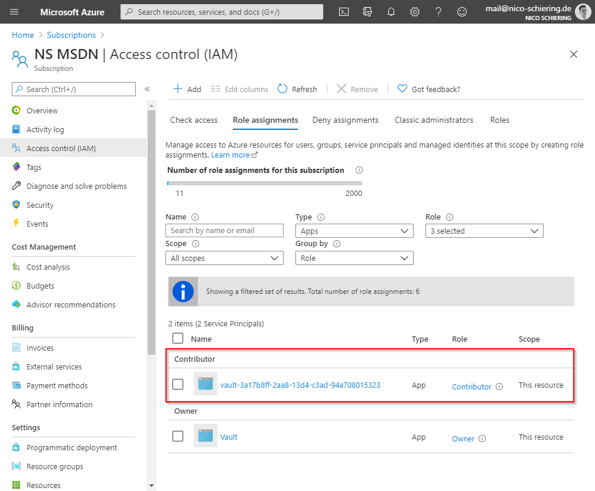
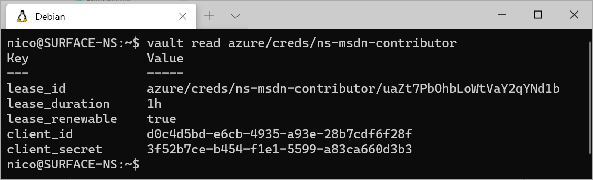

+++
title = "Creating Dynamic Azure Service Principals for Terraform with HashiCorp Vault"
date = "2020-06-23"
tags = [
    "azure",
    "vault",
]
+++

Everyone knows, static secrets are bad and regularly rotating them is a must. But what’s better then rotated static secrets? Right, dynamic access! And that’s were Vault from HashiCorp comes in.

## What is Vault?

Vault is a cloud native secret management solution from HashiCorp. It tightly controls access to secrets and encryption keys by authenticating against trusted sources of identity such as Active Directory, LDAP, Kubernetes, CloudFoundry, and cloud platforms. Vault enables fine grained authorization of which users and applications are permitted access to secrets and keys.

## Azure Secrets Engine

The Azure Secrets Engine dynamically generates Azure service principals along with role and group assignments. Vault roles can be mapped to one or more Azure roles, and optionally group assignments, providing a simple, flexible way to manage the permissions granted to generated service principals.

## Installing Vault

Before you start, you need to install Vault. I’ve deployed the Vault [Helm chart](https://github.com/hashicorp/vault-helm) on AKS. Check out the Vault [documentation](https://www.vaultproject.io/docs/platform/k8s) for the best practices.

## Creating a Service Principal

Vault needs a service principal to be able to create further dynamic service principals and assign them roles at subscription or resource level.

In my case, I want to let Vault create dynamic service principals with permissions on the entire subscription. Therefore I need to assign the Vault service principal the Owner role on my subscription.



The Vault service principal is now able to do role assignments on the entire subscription. However, it's still not able to create and manage service principals. Therefore you need to grant the below Microsoft Graph API and Azure Active Directory Graph permissions to the Vault service principal.



If you want to automate this process, check out my blog post about [Granting Azure AD Admin Consent Programmatically](https://blog.nico-schiering.de/granting-azure-ad-admin-consent-programmatically/).

## Configuring Vault

Now you need to enable the Azure Secret Engine in Vault. Therefore execute the bellow command. Make sure to replace **subscription\_id** and **tenant\_id** with your information and **client\_id** and **client\_secret** with those of the Vault service principal.

```bash
vault write azure/config \
subscription_id=7a5a1bab-6098-4a31-8ed0-b8987e9ddfbe \
tenant_id=90ec3c4c-9eb8-4adf-b1d1-5396c5128450 \
client_id=255ad937-cb27-4a44-8827-9108c350cc3e \
client_secret=YrUEcF.NV8fN3~074s4opN.WZE~t81PY.R
```

### Creating a Role

Roles let you configure a set of Azure roles on a certain scope, along with a role-specific time to live (TTL), which indicates the maximum lifetime of the service principal. Vault will delete the service principal after the TTL has exceeded, if the service principal has not been revoked before.

My role will grant the Contributor role to the subscription NS MSDN and has a TTL of 1 hour.

```bash
vault write azure/roles/ns-msdn-contributor ttl=1h azure_roles=-<<EOF
  [
    {
      "role_name": "Contributor",
      "scope":  "/subscriptions/7a5a1bab-6098-4a31-8ed0-b8987e9ddfbe"
    }
  ]
EOF
```

### Creating a Vault Policy

To grant a Vault user access to the role you need to create a Vault policy, which we assign to a user later.

This policy will grant permissions to the role ns-msdn-contributor. Paste the below HCL code to a file named vault-policy.hcl.

```bash
path "azure/creds/ns-msdn-contributor" {
  capabilities = ["read"]
}

path "azure/config" {
  capabilities = ["read"]
}

path "auth/token/create" {
  capabilities = ["create", "read", "update", "list"]
}
```

Then execute the below command.

```bash
vault policy write ns-msdn-contributor vault-policy.hcl
```

### Creating a Vault User

For my setup I use the userpass [Auth Method](https://www.vaultproject.io/docs/auth/userpass), which is an username/password based authentication against Vault.

To enable the userpass Auth Method execute the below command.

```bash
vault auth enable userpass
```

To create a user called **terraform** with the password **foo** and the policy **ns-msdn-contributor**, execute the below command.

```bash
vault write auth/userpass/users/terraform\
    password=foo \
    policies=ns-msdn-contributor
```

## Creating a Dynamic Service Principal through Terraform

The below Terraform code will retrieve a dynamic service principal from Vault and use it to authenticate against the Azure Resource Manager to deploy a resource group named example.

```hcl
variable "tenant_id" {
  type = string
}

variable "subscription_id" {
  type = string
}

variable "vault_username" {
  type = string
}

variable "vault_password" {
  type = string
}

provider "vault" {
  address = "https://vault.nicoo.org"

  auth_login {
    path = var.vault_username

    parameters = {
      password = var.vault_password
    }
  }
}

data "vault_azure_access_credentials" "creds" {
  backend        = "azure"
  role           = "ns-msdn-contributor"
  validate_creds = true
}

provider "azurerm" {
  disable_terraform_partner_id = true
  version                      = "=2.0"
  tenant_id                    = var.tenant_id
  subscription_id              = var.subscription_id
  client_id                    = data.vault_azure_access_credentials.creds.client_id
  client_secret                = data.vault_azure_access_credentials.creds.client_secret
  features {}
}

resource "azurerm_resource_group" "example" {
  name     = "example"
  location = "West Europe"
}
```

For var.vault\_username use the below syntax.

```bash
auth/userpass/login/terraform
```

During the terraform plan you can see one of the dynamic service principals in the role assignments of the subscription. This service principal was created by Vault and will be deleted by Vault once the deployment is done or the TTL has exceeded.



## Creating a Dynamic Service Principal through the Vault CLI

You can also create a dynamic service principal "manually" through the Vault CLI.

```bash
vault read azure/creds/ns-msdn-contributor
```



Check out the Vault documentation about [auditing](https://www.vaultproject.io/docs/audit/file), to get a full overview of which service is retrieving secrets from Vault.
